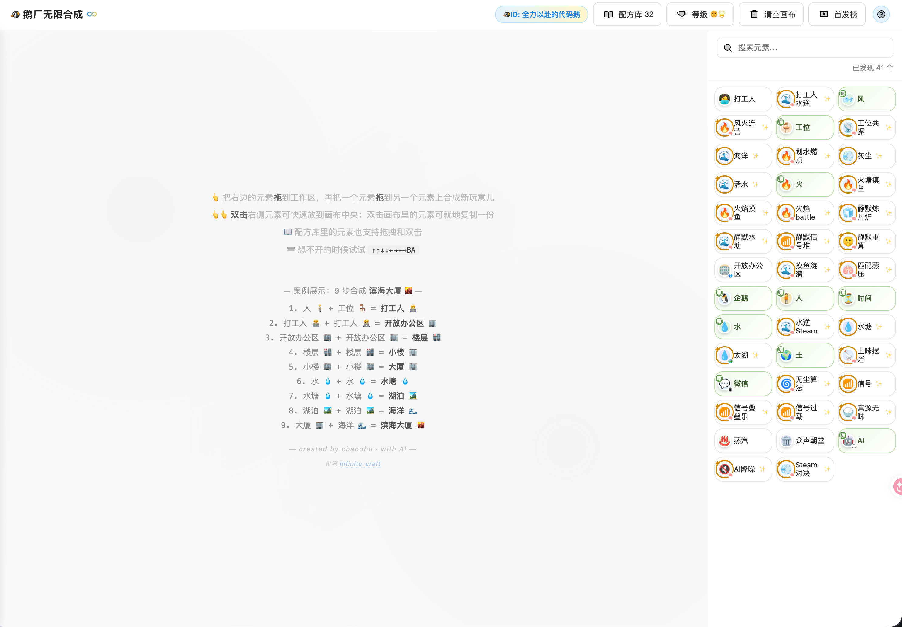
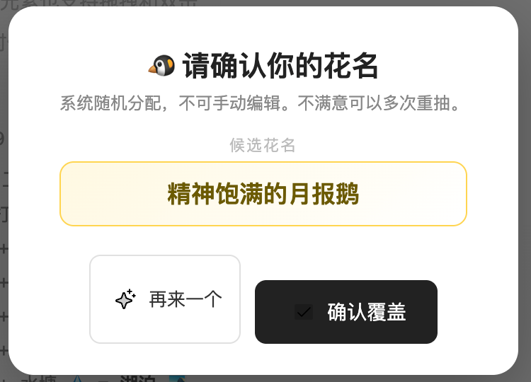
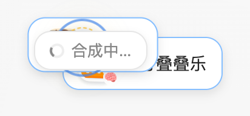
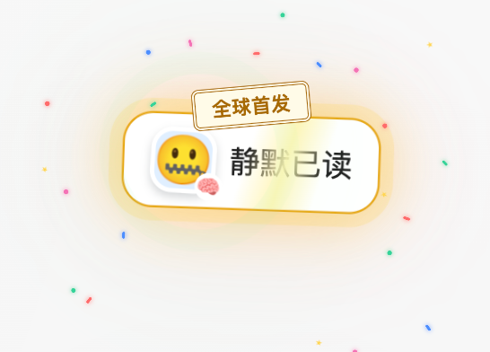
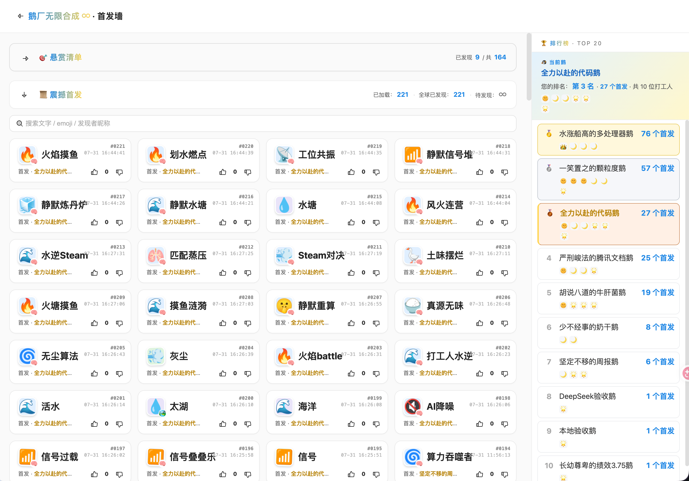

<div align="center">

# 🐧 Infinity Craft · 鹅厂打工人版

### 一个由大模型驱动、融合互联网职场文化的无限合成游戏

把「人」和「工位」合成「打工人」，再从一只企鹅出发，创造属于你的职场宇宙。

`AI 内容生成` · `游戏化产品设计` · `FastAPI` · `EdgeOne Makers` · `双运行时架构`

[产品亮点](#product-highlights) · [AI 工作流](#ai-workflow) · [系统架构](#system-architecture) · [快速开始](#quick-start)

</div>



## ✨ 项目概览

Infinity Craft 以 [neal.fun/infinite-craft](https://neal.fun/infinite-craft/) 的无限合成玩法为灵感，将内容主题重新设计为鹅厂打工人文化、社交平台热梗和互联网黑话。

它不只是一个调用 LLM 的 Demo，而是一套完整的 AI 原生产品闭环：

```text
获得随机职场身份
        ↓
拖拽两个元素进行合成
        ↓
预设 / 缓存命中 ──→ 即时返回
        │
        └─ 未知组合 ──→ LLM 生成元素、Emoji 与一句话点评
                               ↓
                    首发判定、积分成长、持久化
                               ↓
                    首发墙、排行榜与社区互动
```

项目覆盖了从创意验证、AI 内容生成、交互设计，到前后端实现、数据持久化、测试与生产部署的完整过程。

<a id="product-highlights"></a>

## 🚀 产品亮点

| 能力 | 产品体验 |
| --- | --- |
| **无限内容生成** | 未知元素组合由 LLM 动态生成，让有限种子词库持续生长 |
| **可解释的 AI 反馈** | 每次合成同时返回名称、Emoji 和一句话点评，而不是只给出孤立结果 |
| **发现与成长体系** | 区分全球首发、我的新发现与再次合成，并将稀有配方转化为积分和等级 |
| **社区竞争闭环** | 首发墙、排行榜、点赞点踩、评论和悬赏让单机合成变成多人异步探索 |
| **稳定的降级策略** | 预设配方、缓存复用、结构化校验与 fallback 共同保证模型不可用时仍可游玩 |
| **面向生产部署** | 本地开发与边缘生产环境完全隔离，分别适配关系型数据和全球边缘 KV |

## 🎮 从一次合成到全球首发

玩家进入游戏时会获得随机且不可编辑的职场花名；拖拽元素发起合成后，系统展示生成状态，并在新结果首次出现时触发全球首发反馈。

<table>
  <tr>
    <td width="34%" align="center"><strong>1. 获得职场身份</strong></td>
    <td width="28%" align="center"><strong>2. 发起元素合成</strong></td>
    <td width="38%" align="center"><strong>3. 解锁全球首发</strong></td>
  </tr>
  <tr>
    <td></td>
    <td></td>
    <td></td>
  </tr>
</table>

所有玩家的探索会汇聚到首发墙。这里不仅记录新元素，还提供全文搜索、发现进度、互动数据、个人排名与 TOP 20 排行榜。



### 不止是合成

- **配方库**：收藏已经发现的元素，支持搜索、拖拽和快速复用。
- **首发墙**：按时间展示全球发现，支持搜索、分页、点赞、点踩和评论。
- **积分等级**：根据配方类型和发现状态累计分数，以 `🌟 → 🌙 → 🌞 → 👑` 呈现成长。
- **排行榜**：按首发数量展示玩家排名，让探索过程具有持续目标。
- **悬赏机制**：社区可以围绕尚未发现的目标发起协作挑战。
- **P0 爆炸模式**：特定组合触发具有职场语境的视觉彩蛋。
- **隐藏玩法**：输入 `↑↑↓↓←→←→BA` 可切换老板黑话模式。
- **运营能力**：提供受令牌保护的管理与分析接口，便于观察和治理社区内容。

<a id="ai-workflow"></a>

## 🤖 AI 如何参与合成

模型只负责最适合生成式 AI 的未知内容，确定性逻辑仍由应用控制。

```text
POST /api/combine
        │
        ├─ 规范化输入，查询预设配方与历史缓存
        │       └─ 命中：直接复用结果和点评，不重复消耗 Token
        │
        └─ 未命中：调用 OpenAI-compatible 模型
                ├─ 生成元素名称
                ├─ 选择语义 Emoji
                └─ 生成一句话职场点评
                        ↓
                服务端校验与安全降级
                        ↓
                持久化结果、判定发现状态、更新积分
```

### 关键设计决策

1. **Seed / Cache First**
   预设配方和历史结果优先于模型调用，降低延迟与 Token 成本，也让经典组合保持一致。

2. **结构化输出与边界校验**
   服务端验证模型返回的名称、Emoji 和点评；点评为空、含换行或超过长度限制时自动使用默认文案。

3. **同一配方结果复用**
   合成结果与点评一起持久化。后续玩家命中相同组合时读取已有结果，避免内容漂移和重复调用。

4. **故障可降级**
   没有 API Key、模型超时或输出不合规时，系统仍能使用预设、缓存或 fallback 返回有效元素。

5. **提示词与业务规则分离**
   Few-shot 示例负责塑造职场语义，首发、积分、排行、限频和存储一致性由确定性代码处理。

一次合成的典型响应：

```json
{
  "result": "需求膨胀",
  "emoji": "🎈",
  "comment": "一行需求开完会，变成季度项目。",
  "is_first": false
}
```

## 🛠️ 工程化亮点

### 双运行时，而不是“一套配置跑所有环境”

本地开发和线上生产共享组合提示词、花名语料和应用层请求限制，但针对运行环境采用不同的后端与存储：

| 场景 | API 运行时 | 存储 | 模型 |
| --- | --- | --- | --- |
| 本地开发 | FastAPI | Redis + SQLite | DeepSeek OpenAI-compatible API |
| 线上生产 | Makers Edge Functions | `test → infinite_craft` KV | Makers Models |

- 本地环境一条命令启动，支持 Uvicorn 热重载，不需要 EdgeOne 账号。
- PR 合并到 `main` 后由 Git 集成自动发布，静态页面和 API 运行在边缘节点。
- 本地与线上数据完全隔离，避免开发数据污染生产 KV。
- KV 热区、历史分页、分片统计和最终一致性按边缘存储约束设计。

### 共享业务契约

本次统一的三类共享业务契约在 `shared/` 下维护：
`combine-prompt.json` 是组合提示词的唯一编辑源，`nickname-data.json` 是正常运行与
构建使用的已提交花名语料，`runtime-contract.json` 是五项应用层请求限制的唯一编辑
源。`npm run build` 会据此重新生成 `edge-functions/_generated/` 下的 Makers 模块；
生成文件不要手工修改。花名原始语料仅由维护者通过 `npm run refresh:nickname-corpus`
手动刷新，日常运行和构建不依赖被忽略的 `words/` 目录。

共享契约不意味着两个运行时逐字节相同：Redis + SQLite 与最终一致的 KV、模型提供方、
SSE 投递、限频存储和统计精度仍按各自平台实现。完整边界见
[开发与 Makers 发布指南](docs/makers-development.md#共享业务契约与运行时边界)。

### 可控的模型成本与风险

- 历史组合缓存避免重复生成。
- 未知组合模型调用支持超时、重试和每访客限频。
- 模型文本统一以安全的文本节点渲染，避免把生成内容直接注入 HTML。
- 管理与分析接口由 `ADMIN_TOKEN` 保护，未配置时默认关闭。

### 离线可用的图标系统

591 个预设元素拥有构建期生成并提交到仓库的图标映射。运行时按照“持久化 Icon 配方 → 预设映射 → 本地 Emoji PNG → 原生 Emoji → `❓`”逐级回退，不依赖第三方 Icon CDN。

### 自动化验证

仓库同时包含：

- Node.js 测试：覆盖 Makers 路由、KV、种子数据、配置、前端行为和构建产物。
- Python 测试：覆盖本地 FastAPI 业务、LLM、社区、积分、悬赏与数据兼容。
- 构建期资产检查：验证生成数据、图标素材和静态站点输出。

<a id="system-architecture"></a>

## 🏗️ 系统架构

```text
本地开发

┌─────────┐      ┌──────────────┐      ┌──────────────┐
│ Browser │ ───→ │ FastAPI      │ ───→ │ Redis        │
└─────────┘      │ Local API    │      │ Hot Cache    │
                 └──────┬───────┘      └──────────────┘
                        ├─────────────→ SQLite
                        └─────────────→ DeepSeek API


线上生产

┌─────────┐      ┌──────────────────────┐
│ Browser │ ───→ │ EdgeOne Makers      │
└─────────┘      │ Static Site          │
                 │ + Edge Functions     │
                 └──────────┬───────────┘
                            ├──────────→ EdgeOne KV
                            └──────────→ Makers Models
```

### 技术栈

| 分层 | 技术 |
| --- | --- |
| 交互与页面 | HTML、CSS、Vanilla JavaScript |
| 本地 API | Python、FastAPI、Uvicorn |
| 生产 API | EdgeOne Makers Edge Functions |
| AI | OpenAI-compatible API、DeepSeek、Makers Models、Prompt Engineering |
| 数据 | Redis、SQLite、EdgeOne KV |
| 工程 | Docker Compose、Node.js 构建脚本、Python / Node.js 测试 |

<a id="quick-start"></a>

## 🚦 快速开始

### 环境要求

- Node.js 20 或更高版本
- Docker Desktop，或带 Compose 插件的 Docker Engine

### 启动项目

```bash
git clone https://github.com/ythere-y/infinite-craft-TC.git
cd infinite-craft-TC

cp .env.example .env
# 可选：在 .env 的 LLM_API_KEY 中填写自己的 DeepSeek API Key
# 使用本地管理后台时，在 .env 中设置非空 ADMIN_TOKEN
npm run dev
```

打开：

- 游戏：<http://127.0.0.1:8000/>
- 首发墙：<http://127.0.0.1:8000/wall>
- 管理后台：<http://127.0.0.1:8000/admin>
- 健康检查：<http://127.0.0.1:8000/api/health>

没有 API Key 时服务仍可启动，预设配方和缓存正常可用；未知组合会走既有 fallback。密钥只能写入 `.env`，请勿提交到 Git。

### 本地 Prompt 发布与回滚

1. 在 `.env` 设置非空 `ADMIN_TOKEN`。
2. 启动本地服务并访问 `/admin`，输入同一个管理员令牌。
3. 在“Prompt 管理”页编辑并保存草稿。
4. 点击“聚合”，检查生成版本的完整预览。
5. 确认后将该版本设为生效；需要回滚时，在历史版本中重新启用目标版本。

草稿、聚合版本和生效指针只保存在本地 SQLite。Makers 构建继续使用仓库中已提交的
`shared/combine-prompt.json`，不会读取或发布本地 SQLite Prompt 配置。

停止服务：

```bash
npm run dev:down
```

## 🧪 验证与构建

```bash
# Makers / Node.js 测试
npm test

# FastAPI / Python 测试
python3 -m pytest tests --ignore=tests/test_combine_feedback.py -q

# 生成生产静态站点
npm run build
```

安装 EdgeOne CLI 的发布维护者还可以运行 `npm run makers:build`，验证 Makers 构建与 Edge Function 编译。

## 📁 项目结构

```text
infinite-craft-TC/
├── backend/             FastAPI、本地存储、LLM 与领域逻辑
├── frontend/            游戏、首发墙与管理页面
├── edge-functions/      Makers 生产 API、KV 与 Models 适配
├── shared/              双运行时共享的提示词、花名语料与请求限制
├── scripts/             静态构建、种子数据与图标生成
├── tests/               Python / FastAPI 测试
├── tests-makers/        Node.js / Makers 测试
├── docs/                架构、开发与改进文档
├── docker-compose.yml   本地 FastAPI + Redis 环境
├── edgeone.json         Makers 自动构建配置
└── package.json         启动、测试与构建命令
```

## 🔧 扩展与深入开发

- [开发与 Makers 发布指南](docs/makers-development.md)：环境隔离、配置、部署和故障排查。
- [后端词库说明](backend/README.md)：种子元素、固定配方与 Few-shot 示例。
- [Icon 系统审计](docs/icon-system-audit.md)：图标映射、语义规则与资产完整性。

固定词条位于 `backend/seed_elements.json` 和 `backend/seed_combinations.json`。扩展词库时，应同步考虑语义图标映射与典型 Prompt 示例，并运行完整测试和构建检查。

> **部署说明：** EdgeOne Makers 是当前唯一主动维护的生产平台；历史 Render 部署已暂停，相关配置可通过 Git 记录追溯。

## 💡 项目价值

这个项目重点探索了一个 AI 应用开发中的核心问题：

> 如何让大模型成为产品体验的一部分，而不是停留在一个输入框和一次 API 调用？

Infinity Craft 将生成式 AI 放入可重复游玩的内容循环，并通过缓存、持久化、成长体系、社区互动、可观测接口和双环境部署，把不确定的模型能力包装成一套可持续运行的产品。

## 🙏 灵感与致谢

- 核心合成玩法灵感来自 [neal.fun/infinite-craft](https://neal.fun/infinite-craft/)。
- 项目内容主题、AI 生成链路、成长系统、首发墙、社区机制与双运行时工程实现均围绕本项目场景重新设计。
